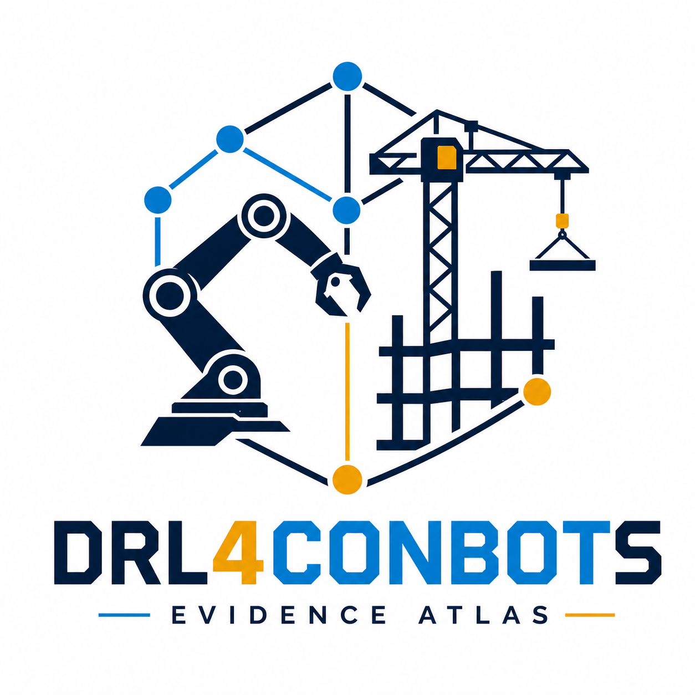
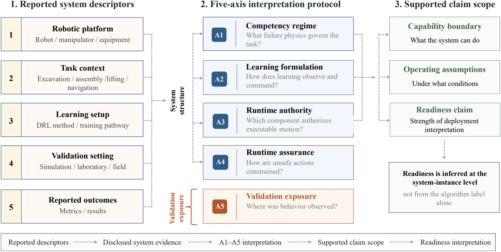
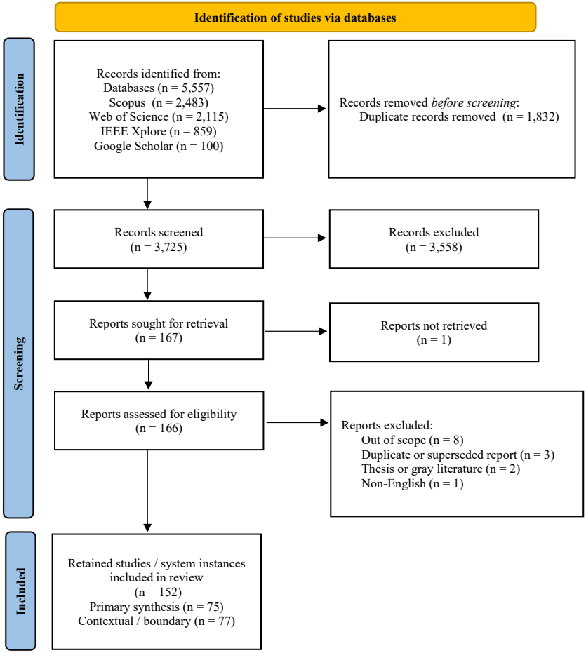
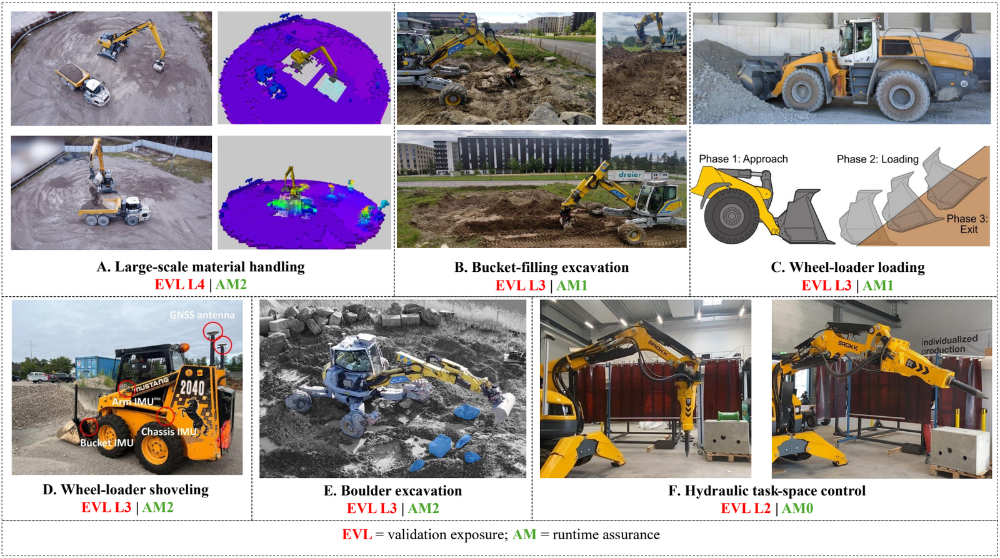
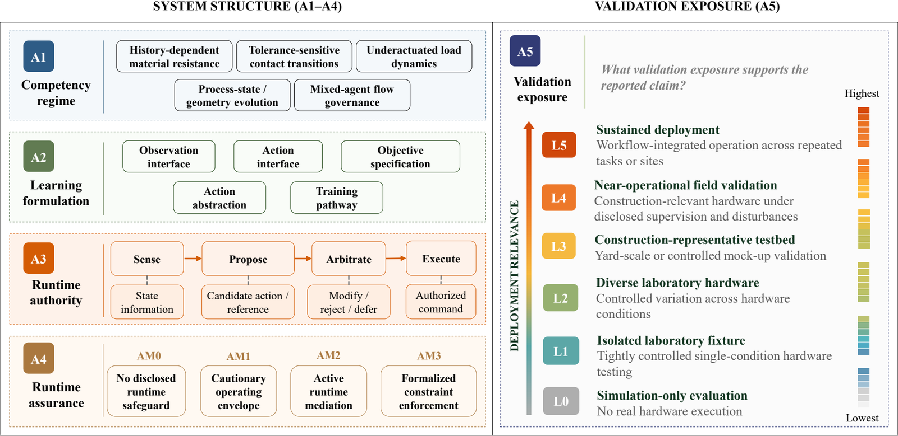
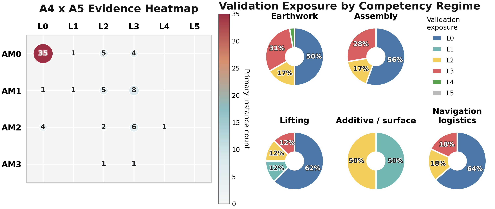
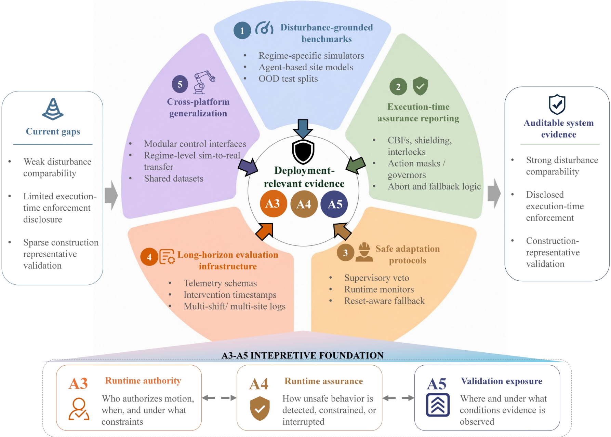

<p align="center">
  
</p>

<h1 align="center">DRL4CONBOTS: Deep Reinforcement Learning for Construction Robotics</h1>

<p align="center">
<strong>Zekai Jin<sup>1</sup>, Huiguang Wang<sup>1</sup>, Yihong Tang<sup>1</sup>, Zhen Dong<sup>2,3</sup>, Chen Feng<sup>4</sup>, and Yi Shao<sup>1,5,*</sup></strong><br>
<sup>1</sup>Department of Civil Engineering, McGill University, Montreal, QC, Canada<br>
<sup>2</sup>Department of Computer Science, University of California, Santa Barbara, Santa Barbara, CA, USA<br>
<sup>3</sup>NVIDIA Corporation, Santa Clara, CA, USA<br>
<sup>4</sup>Department of Mechanical and Aerospace Engineering, Tandon School of Engineering, New York University, NY, USA<br>
<sup>5</sup>Department of Civil Engineering, University of British Columbia, Vancouver, Canada<br>
<sup>*</sup>Corresponding author: <a href="mailto:yi.shao@ubc.ca">yi.shao@ubc.ca</a>
</p>

<div align="center">
<a href="https://github.com/ZekaiJ/DRL4CONBOTS/stargazers"></a>
<a href="#"></a>
<a href="#"></a>
<a href="LICENSE"></a>
</div>

<p align="center">

</p>
<h5 align=center>Graphical overview of the DRL4CONBOTS evidence framework for deployment-relevant DRL in construction robotics.</h5>

> A curated companion repository for **Deep Reinforcement Learning for Construction Robotics (DRL4CONBOTS)**.
>
> This repository accompanies the manuscript under review in **Automation in Construction**, **"Deep Reinforcement Learning for Construction Robotics: A System-Level Taxonomy and Evidence Map toward Real-World Readiness"**.
>
> DRL-enabled construction robotics is moving from isolated task demonstrations toward system-level questions about authority, runtime assurance, validation exposure, and deployment-relevant evidence. This repository tracks representative papers, taxonomy figures, and evidence patterns for researchers, practitioners, and students working at the intersection of construction automation, robot learning, and field robotics.
>
> Contact: zekai.jin@mail.mcgill.ca

## Table of Contents
- [News and Updates](#news-and-updates)
- [Corpus and Screening](#corpus-and-screening)
- [Framework and Taxonomy](#framework-and-taxonomy)
- [Evidence Diagnostic](#evidence-diagnostic)
- [Representative Papers by Category](#representative-papers-by-category)
  - [Earthwork and Material Processing](#earthwork-and-material-processing)
  - [Structural Assembly and Installation](#structural-assembly-and-installation)
  - [Material Placement and Lifting](#material-placement-and-lifting)
  - [Additive Manufacturing and Surface Processing](#additive-manufacturing-and-surface-processing)
  - [Navigation, Layout, and Logistics Support](#navigation-layout-and-logistics-support)
- [Evidence Trends](#evidence-trends)
- [Primary Evidence Regimes](#primary-evidence-regimes)
- [Citation](#citation)
- [License & contact](#license--contact)

## News and Updates
- **[June 2026] Repository launch:** `DRL4CONBOTS` is prepared as the public companion repository for the manuscript under review in Automation in Construction.
- **[June 2026] Evidence map released:** The current repository tracks **152 coded construction-robotics instances**, including **75 primary DRL instances**.
- **[June 2026] Core finding:** Across the **75** primary DRL instances, **35** are simultaneously **AM0** and **EVL L0**, while **0** reach sustained workflow-integrated deployment.

## Corpus and Screening
The review uses a report-level PRISMA screening process before coding system-instance evidence for taxonomy and readiness analysis.

<p align="center">

</p>
<h5 align=center>PRISMA flow from database search to the final coded evidence base.</h5>

## Framework and Taxonomy
**DRL4CONBOTS** is a system-level evidence map for deep reinforcement learning in construction robotics. Instead of ranking algorithms by task success alone, it interprets what each reported robotic system can credibly claim based on its task regime, learning formulation, runtime authority, runtime assurance, and validation exposure.

The review uses five coupled dimensions:

- **A1. Competency regime:** earthwork, assembly, lifting, additive/surface processing, or navigation/logistics.
- **A2. Learning formulation:** observation interface, action abstraction, decision formalism, objective specification, and training pathway.
- **A3. Runtime authority:** who senses, proposes, arbitrates, and executes robot behavior.
- **A4. Runtime assurance:** whether execution-time safeguards, constraints, monitors, or fallback layers are disclosed.
- **A5. Validation exposure:** where behavior is tested, from simulation-only evaluation to sustained field deployment.

<p align="center">

</p>
<h5 align=center>Five construction-robotics competency regimes used to organize task-specific evidence and deployment bottlenecks.</h5>

### Methodology Figures

<p align="center">

</p>
<h5 align=center>Methodological translation logic: reported task outcomes are interpreted as bounded deployment-relevant claim scope through the five-axis framework.</h5>


## Evidence Diagnostic
A cross-axis view of runtime-assurance disclosure and validation exposure across competency regimes.

<p align="center">

</p>
<h5 align=center>Runtime assurance (A4) against validation exposure (A5), with validation-exposure composition by competency regime.</h5>

## Representative Papers by Category
Selected papers are grouped by the five competency regimes used in the DRL4CONBOTS framework.

#### **Earthwork and Material Processing**
*Function: Learn excavation, grading, loading, material handling, and machine-level interaction where soil, rock, traction, tool load, and material-state evolution dominate claim scope.*

- **Near-operational material handling**
    - **[Large-Scale Robotic Material Handling: Learning, Planning, and Control](https://doi.org/10.1109/TFR.2026.3662619)**. *Spinelli, F. A. et al.* **[IEEE TFR 2026]**.
        - *Highlight: The only primary instance reaching EVL L4 in the current synthesis; combines learning, planning, real-machine material handling, and disclosed runtime constraints.*
- **Full-scale excavation and loading**
    - **[Reinforcement Learning-Based Bucket Filling for Autonomous Excavation](https://doi.org/10.1109/TFR.2024.3432508)**. *Egli, P. et al.* **[IEEE TFR 2024]**.
        - *Highlight: Connects randomized simulation with full-size excavation and bucket-filling evidence.*
    - **[Automatic Loading of Unknown Material with a Wheel Loader Using Reinforcement Learning](https://doi.org/10.1109/ICRA57147.2024.10610221)**. *Eriksson, D. et al.* **[ICRA 2024]**.
        - *Highlight: Studies online material adaptation on a 24-tonne wheel loader under real-machine loading conditions.*
- **Safety-aware excavation control**
    - **[Safe reinforcement learning for tracking control of uncertain hydraulic excavators](https://doi.org/10.1007/s11071-025-11500-w)**. *Chen, K. et al.* **[Nonlinear Dynamics 2025]**.
        - *Highlight: Uses safe-RL tracking logic for uncertain hydraulic excavator control and is one of the few AM3-coded primary instances.*

#### **Structural Assembly and Installation**
*Function: Learn tolerance-sensitive placement, insertion, joining, tactile correction, and installation where small pose errors can become jamming, wedging, surface damage, or contact-mode failures.*

- **Contact-rich timber and architectural assembly**
    - **[Robotic assembly of timber joints using reinforcement learning](https://doi.org/10.1016/j.autcon.2021.103569)**. *Apolinarska, A. A. et al.* **[Automation in Construction 2021]**.
        - *Highlight: Combines simulation training, force/torque sensing, and physical lap-joint validation.*
    - **[Robotic architectural assembly with tactile skills: Simulation and optimization](https://doi.org/10.1016/j.autcon.2021.104006)**. *Belousov, B. et al.* **[Automation in Construction 2022]**.
        - *Highlight: Shows why tactile simulation fidelity matters for modular assembly and contact-rich construction tasks.*
- **Installation and tactile transfer**
    - **[Visual-tactile learning of robotic cable-in-duct installation skills](https://doi.org/10.1016/j.autcon.2024.105905)**. *Duan, B. et al.* **[Automation in Construction 2025]**.
        - *Highlight: Connects SAC control, tactile sim-to-real alignment, and physical cable-in-duct trials.*
    - **[Training of construction robots using imitation learning and environmental rewards](https://doi.org/10.1111/mice.13394)**. *Duan, K. et al.* **[Computer-Aided Civil and Infrastructure Engineering 2025]**.
        - *Highlight: Combines imitation learning and environmental rewards for installation-oriented construction robot training.*

#### **Material Placement and Lifting**
*Function: Learn crane, hoist, lift-planning, and suspended-payload behavior where delayed oscillatory dynamics, swept-volume risk, payload variability, and site governance shape readiness claims.*

- **Construction-representative crane control**
    - **[Autonomous construction framework for crane control with enhanced soft actor-critic algorithm and real-time progress monitoring](https://doi.org/10.1111/mice.13427)**. *Xiao, Y. et al.* **[Computer-Aided Civil and Infrastructure Engineering 2025]**.
        - *Highlight: The strongest disclosed lifting-regime validation anchor in the primary set.*
- **Crane dynamics and stabilization**
    - **[Controlling a double-pendulum crane by combining reinforcement learning and conventional control](https://doi.org/10.23919/ACC55779.2023.10156044)**. *Eaglin, G. et al.* **[ACC 2023]**.
        - *Highlight: Demonstrates why hybrid conventional-control-plus-RL structures can outperform RL-only control in crane dynamics.*
    - **[Online reinforcement learning with passivity-based stabilizing term for real time overhead crane control without knowledge of the system model](https://doi.org/10.1016/j.ymssp.2021.108372)**. *Zhang, M. et al.* **[MSSP 2022]**.
        - *Highlight: Uses passivity-based stabilization to structure online RL for overhead crane control.*
- **Lift planning**
    - **[Reinforcement learning-based simulation and automation for tower crane 3D lift planning](https://doi.org/10.1016/j.autcon.2022.104620)**. *Cho, S. et al.* **[Automation in Construction 2022]**.
        - *Highlight: Evaluates tower-crane lift planning in a real-scale virtual site and compares simulated planning behavior with field-related traces.*

#### **Additive Manufacturing and Surface Processing**
*Function: Learn process control and path planning where material rheology, tool wear, cumulative geometry deviation, and irreversible process defects shape the validation burden.*

- **Robotic additive manufacturing**
    - **[Autonomous robotic additive manufacturing through distributed model-free deep reinforcement learning in computational design environments](https://doi.org/10.1007/s41693-022-00069-0)**. *Felbrich, B. et al.* **[Construction Robotics 2022]**.
        - *Highlight: Uses distributed model-free DRL for robotic additive manufacturing in computational design environments.*
- **Concrete 3D printing**
    - **[Reinforcement learning-based continuous path planning and automated concrete 3D printing of complex hollow components](https://doi.org/10.1016/j.autcon.2025.106290)**. *Wang, X. et al.* **[Automation in Construction 2025]**.
        - *Highlight: Optimizes continuous fill-path sequencing for concrete 3D printing of complex hollow components.*

#### **Navigation, Layout, and Logistics Support**
*Function: Learn mobility, routing, worker-aware planning, layout support, and logistics decisions where human co-presence, congestion, occlusion, handover, and governance determine claim scope.*

- **Safety-constrained construction HRC**
    - **[Safety-constrained Deep Reinforcement Learning control for human-robot collaboration in construction](https://doi.org/10.1016/j.autcon.2025.106130)**. *Duan, K. et al.* **[Automation in Construction 2025]**.
        - *Highlight: One of the few navigation/HRC instances with explicit safety-constrained runtime evidence.*
- **Scene-graph and bulldozer navigation**
    - **[Deep reinforcement learning coupled with topological scene graph for dynamic path planning of autonomous bulldozer in complex earthwork construction](https://doi.org/10.1016/j.autcon.2025.106617)**. *Gao, H. et al.* **[Automation in Construction 2026]**.
        - *Highlight: Combines topological scene graphs and DRL for dynamic bulldozer path planning in complex earthwork settings.*
- **Worker-aware planning**
    - **[Prediction-based path planning for safe and efficient human-robot collaboration in construction via deep reinforcement learning](https://doi.org/10.1061/(ASCE)CP.1943-5487.0001056)**. *Cai, J. et al.* **[Journal of Computing in Civil Engineering 2023]**.
        - *Highlight: Combines worker-location prediction with DQN path planning for construction HRC scenarios.*

## Evidence Trends
The current evidence base shows that real-world readiness cannot be inferred from algorithm labels, hardware presence, or field-like demonstrations alone.

<p align="center">

</p>
<h5 align=center>Evidence-closure map for deployment-relevant claims in construction robotics.</h5>

Key findings from the primary synthesis set:

- **Authority-assurance decoupling:** **45/75** primary instances are AM0, and **60/75** remain within AM0-AM1.
- **Simulation without safeguards:** **35/75** primary instances are simultaneously AM0 and EVL L0.
- **Exposure-assurance divergence:** **20/75** primary instances reach EVL L3 or higher, but only **1** reaches EVL L4 and **0** reach EVL L5.

## Primary Evidence Regimes

| **Regime** | **Primary instances** | **Main bottleneck** |
|:--|:--:|:--|
| Earthwork and Material Processing | 36/75 | Long-horizon exposure to soil variability, muck, resistance discontinuities, and intervention histories |
| Structural Assembly and Installation | 18/75 | Tolerance variation, contact-rich disturbances, access constraints, and intervention reporting |
| Material Placement and Lifting | 8/75 | Workflow-coupled lift validation, swing handling, disturbance coverage, and governance |
| Additive Manufacturing and Surface Processing | 2/75 | Scale-dependent process physics, material rheology, and end-to-end process assurance |
| Navigation, Layout, and Logistics Support | 11/75 | Mixed-traffic exposure, handover, communication stress, recovery, and site governance |

## Citation
The manuscript is currently under review in Automation in Construction. Citation metadata will be updated after preprint, acceptance, or journal publication.

```bibtex
@misc{jin2026drl4conbots,
  title        = {DRL4CONBOTS: Deep Reinforcement Learning for Construction Robotics Evidence Map},
  author       = {Jin, Zekai and Wang, Huiguang and Tang, Yihong and Dong, Zhen and Feng, Chen and Shao, Yi},
  year         = {2026},
  howpublished = {Companion repository for a manuscript under review in Automation in Construction},
  url          = {https://github.com/ZekaiJ/DRL4CONBOTS}
}
```

## License & contact
Released under the [MIT](LICENSE) license. Questions, feedback, or collaboration: zekai.jin@mail.mcgill.ca
