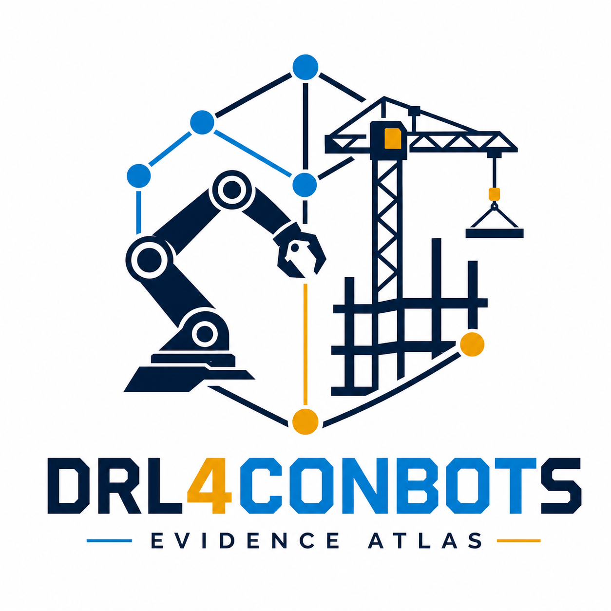

<p align="center"></p>

<h1 align="center">Deep Reinforcement Learning for Construction Robotics</h1>
<h3 align="center">A System-Level Taxonomy and Evidence Map toward Real-World Readiness</h3>

<p align="center">


</p>

This is the companion repository for the systematic review being prepared for resubmission to **Automation in Construction**:

> **Deep Reinforcement Learning for Construction Robotics: A System-Level Taxonomy and Evidence Map toward Real-World Readiness**

The repository release is synchronized with the manuscript search cutoff of **9 August 2026**. It supersedes earlier public materials that used AM/EVL ratings, a 152-instance atlas, or an A1--A5 reconstruction. Those legacy outputs are not findings of the current manuscript and must not be used to interpret it.

## Current evidence base

| Review layer | Count | Role |
|---|---:|---|
| Records identified | 6,409 | Scopus, Web of Science Core Collection, IEEE Xplore, and the initial targeted Google Scholar check |
| Duplicate records removed | 2,358 | Exact DOI and normalized title--year matching |
| Unique records screened | 4,051 | Title--abstract screening |
| Full texts assessed | 155 | Eligibility assessment after two reports could not be retrieved |
| Formal systematic-review corpus | 140 | Reports meeting the embodied-DRL and construction-robotics criteria |
| Cross-dimensional comparative subset | 75 | Reports with sufficient information for structured technical comparison |
| Additional eligible qualitative reports | 65 | Broader task, method, and validation synthesis |
| Supplementary contextual sources | 26 | Adjacent mechanisms, standards, reviews, and emerging applications; excluded from formal denominators |
| Overall evidence base | 166 | Formal reports plus contextual sources |

The numerical distributions in the manuscript describe the **75-report comparative subset**. They are not estimates of field-wide prevalence and are not readiness scores.

## Review process

The review combines systematic literature identification, predefined eligibility criteria, structured data extraction, and cross-dimensional comparative synthesis. Title--abstract screening, full-text eligibility assessment, and structured extraction for the original and update searches were conducted by the first author. The other authors contributed to review design, technical interpretation, and manuscript revision. Independent duplicate screening and duplicate extraction were not undertaken; no inter-rater agreement statistic is claimed.

The principal analytical dimensions are:

1. construction-specific failure regime;
2. learning formulation, including observation, action, objective, and training pathway;
3. command responsibility and runtime authority;
4. execution-time safeguards and recovery pathways; and
5. validation conditions and the operating conclusion supported by the complete system.

The five construction regimes are earthwork and material processing; structural assembly and installation; material placement and lifting; additive manufacturing and surface processing; and navigation, layout, and logistics support.

## Preprint policy

Peer-reviewed journal and conference papers were preferred. A full research preprint could enter the formal corpus only when it reported original embodied-DRL evidence, no archival version was available at the search cutoff, and the full text allowed the same eligibility and comparison criteria to be applied. An archival version replaced a preprint whenever one was available.

Four research preprints met the formal criteria and entered the 75-report comparative subset. One additional emerging preprint was used only as contextual evidence. A peer-reviewed-only sensitivity check yields **136 formal reports** and **71 comparative reports**; none of the three cross-regime findings depends on a preprint as its sole support.

## Main synthesis

The review supports three cross-regime findings:

1. the technical relevance of observations, action abstractions, objectives, training pathways, and recovery strategies varies with the governing failure physics;
2. reported performance generally belongs to the complete robot--learning--control configuration because learned outputs recur within planners, controllers, operator actions, and supervisory logic; and
3. representative hardware evaluation does not by itself establish execution-time protection, intervention, recovery, or sustained workflow integration.

## Repository contents

- [`docs/index.html`](docs/index.html): current interactive overview;
- [`evidence/CURRENT_RELEASE_2026-08-10.md`](evidence/CURRENT_RELEASE_2026-08-10.md): release manifest and retired-result notice;
- [`evidence/DISCOVERY_INVENTORY_LINEAGE_2026-08-09.md`](evidence/DISCOVERY_INVENTORY_LINEAGE_2026-08-09.md): count lineage for the current systematic review;
- [`evidence/UPDATE_SEARCH_LOG_2026-08-09.md`](evidence/UPDATE_SEARCH_LOG_2026-08-09.md): reproducible May--August update summary;
- [`evidence/reference_index_166_2026-08-10.csv`](evidence/reference_index_166_2026-08-10.csv): low-inference bibliographic index of the 166 sources discussed;
- [`LEGACY_ASSETS_NOTICE.md`](LEGACY_ASSETS_NOTICE.md): interpretation rules for historical repository assets.

## Figure rights

The current manuscript's representative regime plates are author-drawn vector syntheses. No third-party image is reproduced or adapted in those active figures. Earlier photographic or screenshot-based composites are internal working materials and are not release or submission assets.

## Citation

```bibtex
@article{jin2026drlconstructionrobotics,
  title   = {Deep Reinforcement Learning for Construction Robotics: A System-Level Taxonomy and Evidence Map toward Real-World Readiness},
  author  = {Jin, Zekai and Wang, Huiguang and Tang, Yihong and Dong, Zhen and Feng, Chen and Shao, Yi},
  journal = {Manuscript prepared for Automation in Construction},
  year    = {2026}
}
```

## License and contact

Repository-authored code and text are released under the repository license. Copyright in cited publications remains with their respective rights holders. Contact: `zekai.jin@mail.mcgill.ca`.
